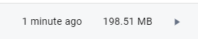

## 探索使用Docker分发next.js项目
 

目标：
1. 使用Docker进行编译，保证编译环境的统一
2. 使用最小可运行的nodejs镜像来运行


### 为什么需要用Docker来分发


### 准备工作


参考文献：

[Next.js Output配置](https://nextjs.org/docs/app/api-reference/next-config-js/output)

[Next.js 部署](https://nextjs.org/docs/app/building-your-application/deploying/static-exports)

> 通过配置`output` ， Next.js 可以自动创建一个 standalone 文件夹，该文件夹仅复制生产部署所需的文件，包括 中的 node_modules select files 。

```js
module.exports = {
  output: 'standalone',
}
```

为了更好的管理配置文件，我们将`next.cofig.js`文件拆分成3份文件
`next.config.base.js`：基础配置文件
`next.config.js`：编译配置文件
`next.config.docker.js`：编译docker配置文件

**思想**： 利用`多阶段构建`

### 准备Dockerfile
```Dockerfile 
# 第一阶段: 构建 Next.js 应用
FROM node:18-alpine AS builder

# 设置工作目录
WORKDIR /app

# 复制 package.json 和 package-lock.json
COPY package.json package-lock.json ./

# 安装依赖
RUN npm install

# 复制应用的其余代码
COPY . .
# 用 Docker 版本的配置文件覆盖 next.config.js
COPY ./next.config.docker.mjs ./next.config.mjs

# 构建 Next.js 应用
RUN npm run build 


# 第二阶段: 运行环境和编译环境分离
FROM node:18-alpine

# 设置工作目录
WORKDIR /app

# 从构建阶段复制构建好的应用和 node_modules
COPY --from=builder /app/.next/standalone ./
# 这些资源可以挂载到CDN
COPY --from=builder /app/.next/static  ./.next/static
# 这些资源可以挂载到CDN
COPY --from=builder /app/public  ./public

# 暴露应用运行的端口
EXPOSE 3000

# 运行应用的命令
CMD ["node","/app/server.js"]
```

上面都有很清晰的解释，这边重点讲一下第二阶段`为什么需要COPY 静态文件`在next.js的构建指南中有一段话如下

> 此外，还输出了一个最小的 `server.js` 文件，可以使用它来代替 `next start` .默认情况下，此最小服务器不会复制 `public` 和 `.next/static` 文件夹，因为理想情况下，这些文件夹应由 CDN 处理，尽管这些文件夹可以手动复制到 `standalone/public` and `standalone/.next/static` 文件夹，之后 server.js 文件将自动提供这些文件夹。


为了应用的完整性，我们选择了手工复制静态文件到相应的目录下，使的server.js文件可以正确加载静态资源。

**最佳实践** 应该将这些静态资源挂载到CDN上，这样可以更好的利用缓存，提高访问速度。

### 构建镜像
```bash
docker build -t nextjs-docker .
```

### 运行容器
```bash
docker run -p 3000:3000 nextjs-dockers
```

至此可以看到，next.js项目已经成功编译，运行在docker容器中。


### 进一步压缩尺寸

可以看到，这个镜像尺寸有点大，实际上编译代码的过程和运行容器是分开的，那么我们是不是可以让运行容器最小化，只保留编译好的文件，以及最基本的nodejs环境，这样可以进一步压缩镜像的尺寸？


虽然 Alpine 镜像已经很小了，但是它依旧包含了许多不必要的组件。那么有没有可能让我们的镜像里不包含包管理工具、SHELL、冗余的二进制文件，只包含最小的可运行系统，以及我们的语言 Runtime，或者核心的 glibc 依赖呢？

有人用上面提到的思路做了一个项目：distroless，这个项目来自谷歌云：(https://github.com/GoogleContainerTools/distroless)[https://github.com/GoogleContainerTools/distroless]


>Distroless 镜像非常小，其中最小的镜像 gcr.io/distroless/static约为 650 kB。这大约是alpine (~ 2.5 MB) 大小的 25% ，以及不到 debian (50 MB)大小的 1.5% 。


我们可以尝试使用这个镜像来构建我们的镜像，这样可以进一步压缩镜像的尺寸。

优化后的Dockerfile:

```Dockerfile
# 第一阶段: 构建 Next.js 应用
FROM node:18-alpine AS builder

# 设置工作目录
WORKDIR /app

# 复制 package.json 和 package-lock.json
COPY package.json package-lock.json ./

# 安装依赖
RUN npm install

# 复制应用的其余代码
COPY . .
# 用 Docker 版本的配置文件覆盖 next.config.js
COPY ./next.config.docker.mjs ./next.config.mjs

# 构建 Next.js 应用
RUN npm run build 


# 第二阶段: 使用 distroless 镜像运行应用
# 使用以语言为中心的容器基础镜像 distroless
FROM gcr.io/distroless/nodejs18-debian12	

# 设置工作目录
WORKDIR /app

# 从构建阶段复制构建好的应用和 node_modules
COPY --from=builder /app/.next/standalone ./
# 这些资源可以挂载到CDN
COPY --from=builder /app/.next/static  ./.next/static
# 这些资源可以挂载到CDN
COPY --from=builder /app/public  ./public

# 暴露应用运行的端口
EXPOSE 3000

# 运行应用的命令(注意！这个镜像默认会以node命令启动，所以要去掉node指令)
CMD ["/app/server.js"]

```

再次查看 我们可以看到 这个镜像缩小了
